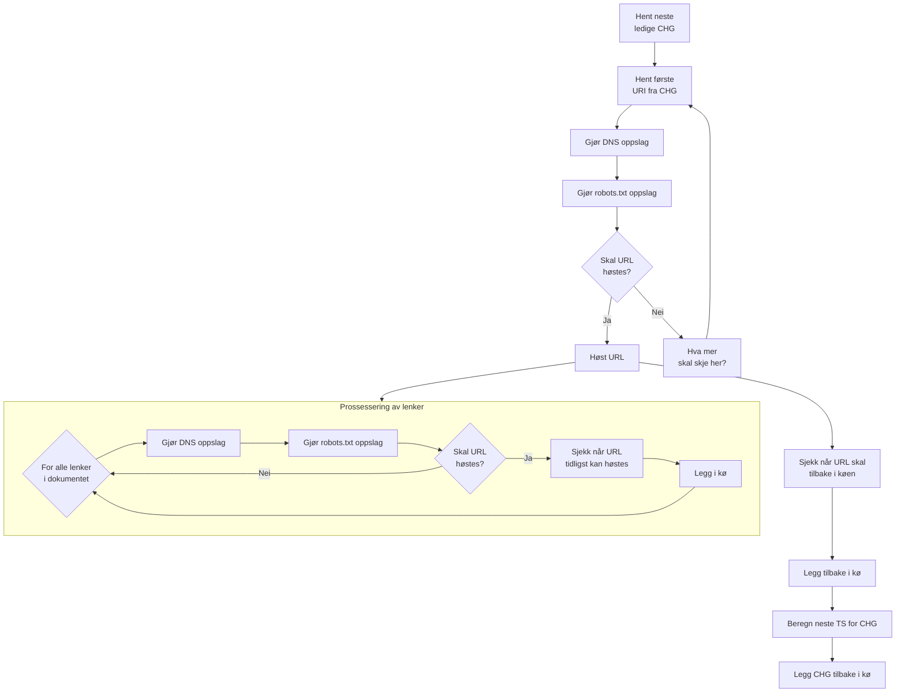

```mermaid
flowchart TD
    s1[Hent neste\n ledige CHG]
    s2[Hent første\n URI fra CHG]
    s3[Gjør DNS oppslag]
    s4[Gjør robots.txt oppslag]
    s5{Skal URL\n høstes?}
    s6[Høst URL]
    s7[Sjekk når URL skal\n tilbake i køen]
    s8[Legg tilbake i kø]
    s9[Beregn neste TS for CHG]
    s10[Legg CHG tilbake i kø]
    l1{For alle lenker\n i dokumentet}
    l2[Gjør DNS oppslag]
    l3[Gjør robots.txt oppslag]
    l4{Skal URL\n høstes?}
    l5[Sjekk når URL\n tidligst kan høstes]
    l6[Legg i kø]
    d1[Hva mer\n skal skje her?]
    s1-->s2
    s2-->s3
    s3-->s4
    s4-->s5
    s5-->|Ja|s6
    s5-->|Nei|d1-->s2
    s6-->s7
    s6-->sg1
    s7-->s8
    s8-->s9
    s9-->s10
    subgraph sg1[Prossessering av lenker]
    l1-->l2-->l3-->l4-->|Ja|l5-->l6-->l1
    l4-->|Nei|l1
    end
```

## URL kø

- **Key:** CHG TS URL
- **Val:** LastFetch Error Cookies
