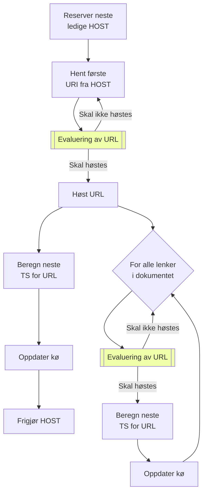
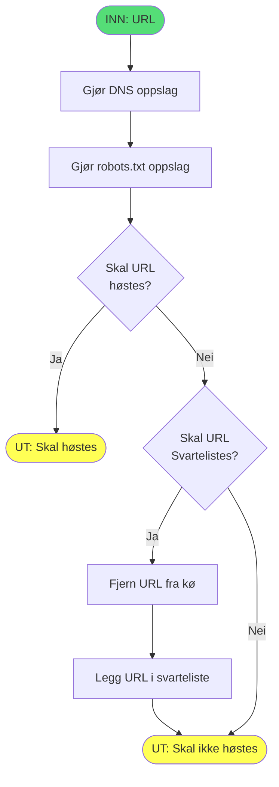

# Varianter

|    | 1. harvest | response | TS < queue | oos     |  robots deny | dns fail | 
|----|------------|----------|------------|---------|--------------|----------|
|  1 | &check;    | &check;  |            |         |              |          |
|  2 | &check;    | &check;  |            | &check; |              |          |
|  3 | &check;    | &check;  |            |         | &check;      |          |
|  4 | &check;    |          |            |         |              |          |
|  5 | &check;    |          |            |         |              | &check;  |
|  6 |            | &check;  | &check;    |         |              |          |
|  7 |            | &check;  | &check;    | &check; |              |          |
|  8 |            | &check;  | &check;    |         | &check;      |          |
|  9 |            | &check;  | &check;    |         |              | &check;  |
| 10 |            | &check;  |            |         |              |          |
| 11 |            | &check;  |            | &check; |              |          |
| 12 |            | &check;  |            |         | &check;      |          |
| 13 |            |          |            |         |              |          |
| 14 |            |          |            |         |              | &check;  |

### Hovedrutine

### Prosedyre for evaluering av URL

## Host

- **Key:** Busy TS HOST
- **Value:** Response time

## URL queue

- **Key:** HOST TS COLLECTION URL
- **Val:** LastFetch ErrorCount NotFoundCount

## Cookie jar

- **Key:** COLLECTION HOST
- **Val:** Cookies

# Utfordringer

* [Host reservation service](host_reservation_service.md)
* Evaluering av config (scope)
* Statistikk
    * I hvilken grad overholdes høstefrekvens-kontrakt
    * Rapporter basert på domene og tid
* Høst en gang URLer
* Avslutte høsting av URL (Svartelisting)
* Høste samme seed/URL med forskjellige cookies

# Roadmap

* Bare hostbasert politeness
* Fjerne collections

# Collections

Hvis vi skal beholde collections, så bør disse også påvirke selve innhøstingen og ikke bare være en måte å navngi
WARC-filer på som i dag. Et forslag er å inkludere collection som en del av URL. Hvis samme seed puttes i flere
collections vil URLene høstes flere ganger helt uavhengig av hverandre (politeness blir likevel respektert). Denne
løsningen kan brukes for å høste samme nettsted med og uten pålogging eller med forskjellige browserinnstillinger.
