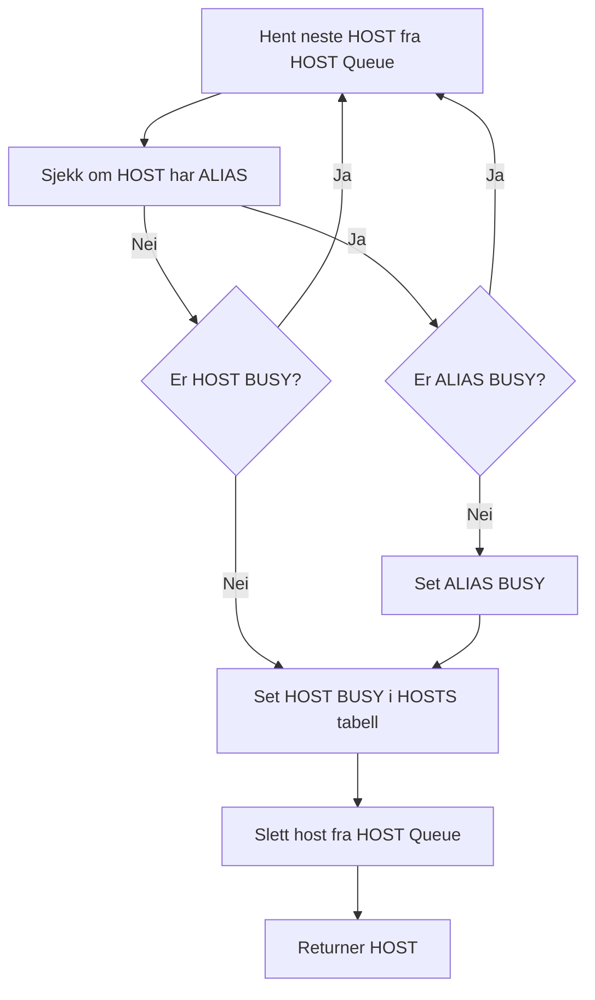

# Host reservation service

The host "database" consists of 4 tables:

1. **Host queue table**: List of hosts ordered by next fetch time.
2. **Host table**:  List of hosts ordered lexicographically with busy/idle status and if busy, their busy timeout.
3. **Host alias table**: Two-way mapping between alias and host.
4. **Busy alias table**: List of busy aliases with the busy host and a busy timeout.

#### Host queue table
- **Key:** TS HOST
- **Value:** NIL

Example contents of the _host queue_ table:

    host queue> 202201010029 rana.kommune.no

#### Host table
- **Key:** HOST
- **Value:** BUSY_TIMEOUT or NULL

Example contents of the _busy host_ table:

    busy host> rana.kommune.no -> 202201012222
    busy host> nb.no -> nil

#### Busy alias table

- **Key:** ALIAS
- **Value:** BUSY_TIMEOUT HOST

Example contents of the _busy alias_ table:

    busy alias> kommune -> 202201012222 rana.kommune.no

#### Host alias table

- **Key:** ALIAS
- **Value:** HOST1 HOST2 ...

- **Key:** HOST
- **Value:** ALIAS

ALIAS must be constrained to not be a valid domain name.

For example can ALIAS be limited to one word composed of only alphanumeric + underscore or dash characters.

Example contents of the _host alias_ table:

    host alias> rana.kommune.no -> kommune
    host alias> vefsn.kommune.no -> kommune
    host alias> kommune -> rana.kommune.no vefsn.kommune.no

## Algorithms

### Populate host queue table

	for i := 0; i < f.Config.Seeds.Size(); i++ {
		s := Seed{}
		Decode(f.Config.Seeds.GetIndex(i), &s)
		u, _ := whatwgUrl.Parse(s.Url)
		qurl := &QueuedUrl{
			Host:  u.Hostname(),
			Ts:    0,
			Url:   s.Url,
			Level: 0,
		}
		f.urlQueue.Put(qurl.Key(), qurl)
		f.hostReservationService.AddHost(NormalizedHost(s.Url))
	}

### Get next available host




The following describes an algorithm that returns the next available host:
1. Get first scheduled host from the _host queue_ table where timestamp
   is less or equal to current time:


    host queue> 202201010000 rana.kommune.no

2. Check if host is aliased or alias is hosted. If not aliased skip to step 4.
3. Set alias busy


    // Atomically check and set value in TiKV:
    // compareAndSwap(key, previous value, new value)
    compareAndSwap(kommune, NIL, current time + busy timout; host)

    busy alias> kommune -> 202201010002 rana.kommune.no
4. Set host busy

   * If host is aliased and alias is busy we set host busy for a short amount of time.
   * If host is not aliased or alias is not busy we set host busy for a time of busy timeout.

For example:


    compareAndSwap(rana.kommune.no, NIL, current time + busy timout)

    busy host> rana.kommune.no -> 202201010002

5. Delete row from step 1.

   This is important to do even if step 3. and 4. fails, to avoid infinite loops if
the delete operation fails. \
A host SHOULD NOT be in the _busy host_ AND _host queue_ tables at the same time,
but for the brief moments the host change status from busy to ready and vica versa. \
If a host is found in both tables (maybe because delete operation in another process didn't succeed), we correct the error effortlessly in this step.


6. Return host only if alias is not busy and host is not busy and step 5. was  successful. 

## External service
``` go
 
func ReserveNextHost() HOST
    GET first row in ordered host table
    SET Busy = True
    SET TS = current time + timeout 
    SET Busy = true in Host tabl
    SET TS to current time + timeout
    return HOST
    
func ReleaseHost(HOST)
    GET first URL from URL queue for given HOST
    SET HOSTs TS to URLs TS
    SET Busy = false
```

## Internal service
Background service to ensure that no host stays in busy state forever
``` go
REPEAT EVERY x seconds:
    FOR every HOST in busy host table WHERE TS > current time:
        SET TS = next host fetch time
        ADD HOST to host queue table
        DELETE host from busy host table
```

Background service to ensure that no alias stays in busy state forever
``` go
REPEAT EVERY x seconds:
    FOR every ALIAS in busy alias table WHERE TS > current time:
        SET ALIAS to empty value in busy alias table
    SET TS = Current time
```
