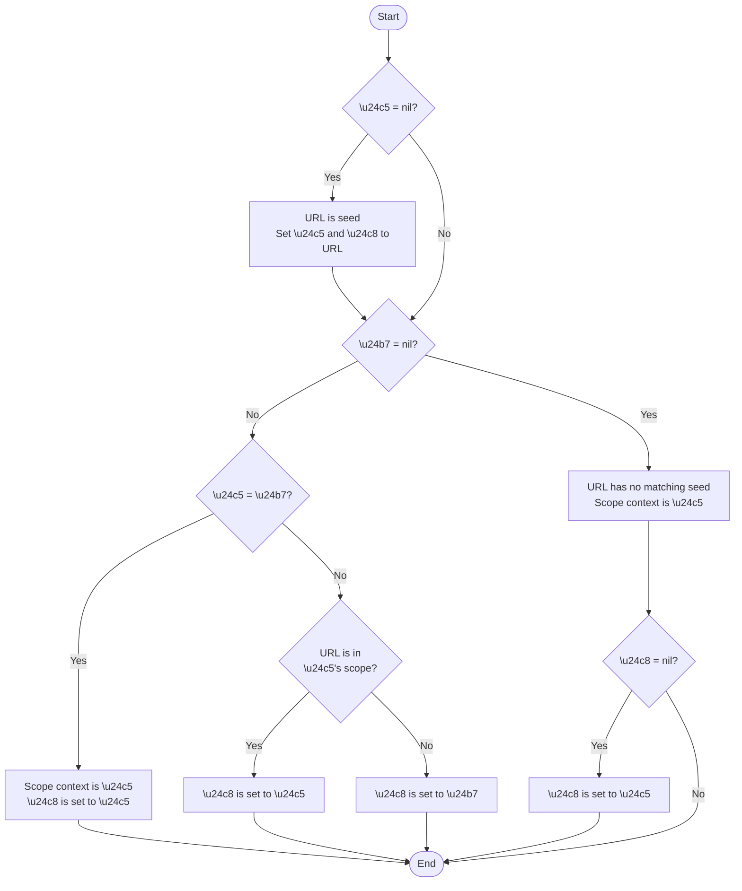
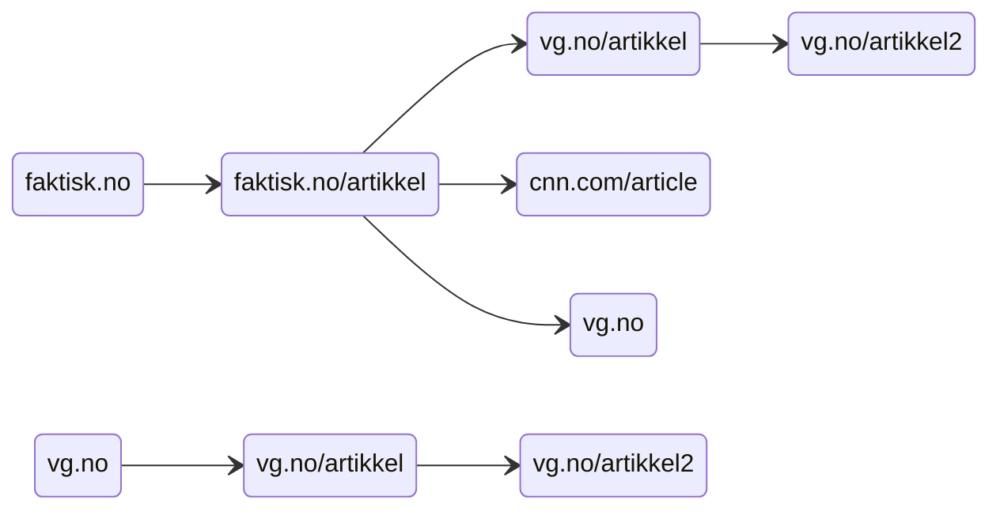
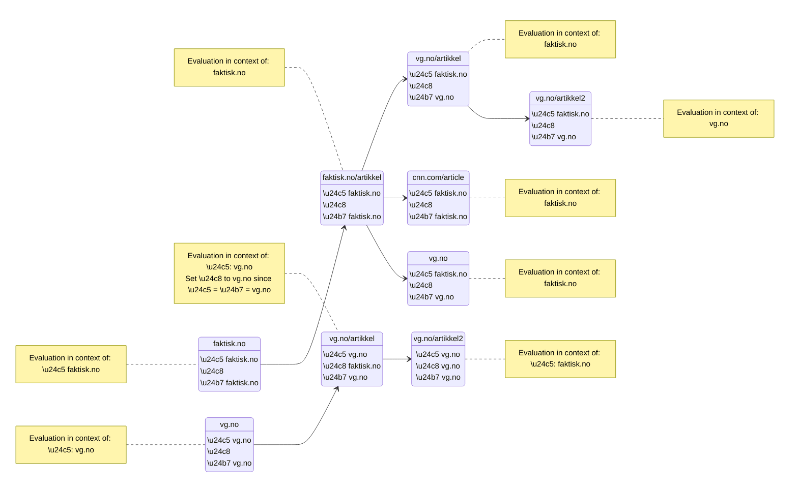
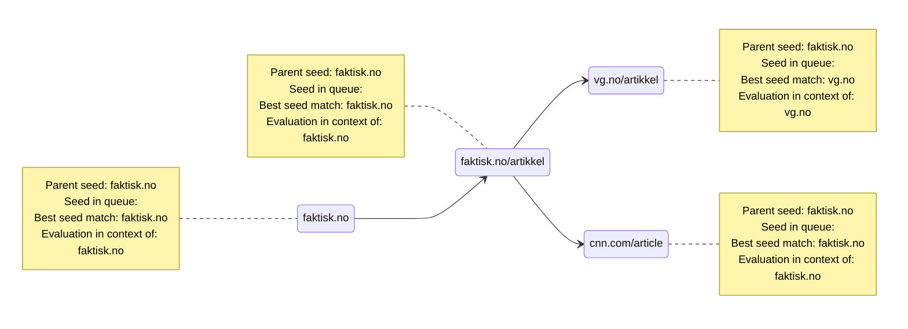
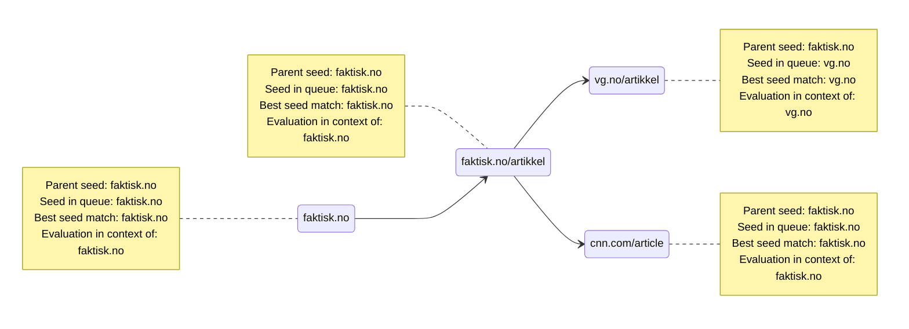

# Algorithm for connecting URL to seed

## Definitions

&#x24c5; Parent URL's seed\
&#x24c8; Seed stored in queued URL\
&#x24b7; Best seed match for URL

## Rules

# Examples

Following examples are based on harvesting the following structure. Seeds are `faktisk.no` and `vg.no`.

## Example 1

### Seeds:

| seed       | scope rules                                                |
|------------|------------------------------------------------------------|
| faktisk.no | scope accepts everything in domain plus one off-domain hop |
| vg.no      | scope accepts everything in domain, but no off-domain hops |

### Legend

&#x24c5; Parent seed\
&#x24c8; Stored in queue\
&#x24b7; Best seed match

### First harvest of domain `faktisk.no`

### Second harvest of domain `faktisk.no`

## Example 2

### Seeds:

| seed       | scope rules                                                |
|------------|------------------------------------------------------------|
| faktisk.no | scope accepts everything in domain, but no off-domain hops |
| vg.no      | scope accepts everything in domain, but no off-domain hops |

### First harvest of domain `faktisk.no`

### Second harvest of domain `faktisk.no`

