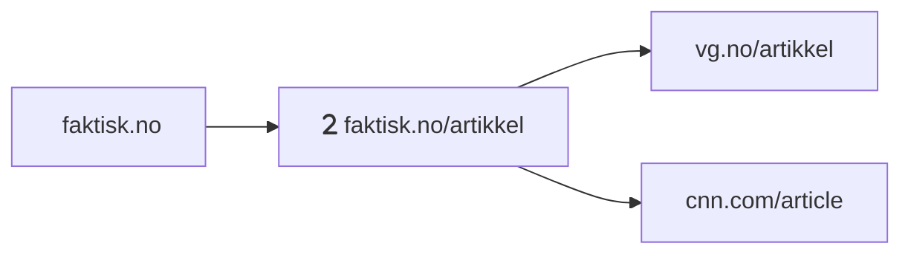
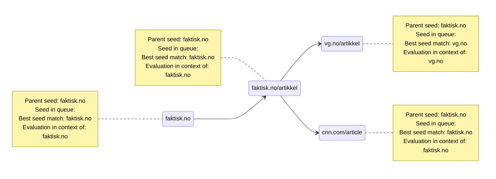
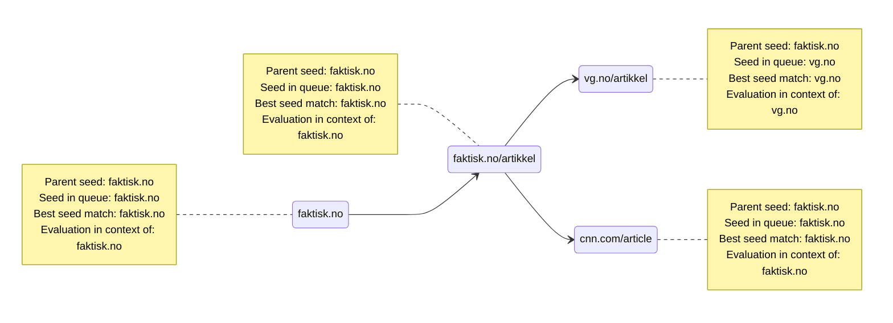

Seeds:

- aaa
- bbb
- bbb/p
- tu
- faktisk

|                                              |      url | parent seed | seed i kø | beste seed match | Resultat      |
| -------------------------------------------- | -------: | ----------- | ---------- | ---------------- | ------------- |
| 1. gangshøsting av seed                     |      aaa | aaa         |            | aaa              | aaa           |
| n'te gangs høsting av seed                  |      aaa | aaa         | aaa        | aaa              | aaa           |
| 1. gangshøsting utlenke til annen seed      |      bbb | aaa         |            | bbb              | bbb           |
| 1. gangshøsting utlenke til annen seed      |      ccc | aaa         |            |                  | aaa           |
| n'te gangshøsting av utlenke til annen seed |      bbb | aaa         | bbb        | bbb              | bbb           |
| n'te gangshøsting av utlenke til annen seed |      ccc | aaa         | aaa        |                  | aaa           |
| 1. gangshøsting utlenke til annen seed      |    bbb/p | bbb         |            | bbb/p            | bbb/p         |
| n'te gangshøsting utlenke til annen seed    |    bbb/p | bbb         | bbb/p      | bbb/p            | bbb/p         |
| n'te gangshøsting utlenke til annen seed    |   tu/art | faktisk     |            | tu               | faktisk OR tu |
| n'te gangshøsting utlenke til annen seed    | .com/art | faktisk     |            |                  | faktisk       |

# Examples
Following examples are based on harvesting the following structure. Seed is `faktisk.no`.

## Example 1

### Seeds:

| seed       | scope rules                                                |
|------------|------------------------------------------------------------|
| faktisk.no | scope accepts everything in domain plus one off-domain hop |
| vg.no      | scope accepts everything in domain, but no off-domain hops |

### First harvest of domain `faktisk.no`

### Second harvest of domain `faktisk.no`

## Example 2

### Seeds:

| seed       | scope rules                                                |
|------------|------------------------------------------------------------|
| faktisk.no | scope accepts everything in domain, but no off-domain hops |
| vg.no      | scope accepts everything in domain, but no off-domain hops |

### First harvest of domain `faktisk.no`

### Second harvest of domain `faktisk.no`

